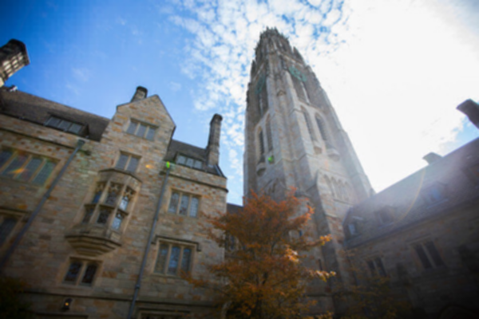
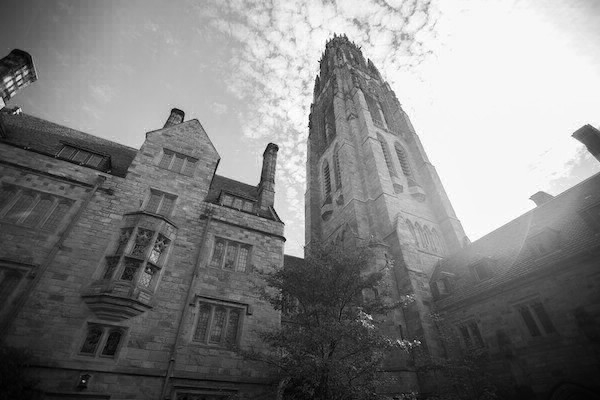
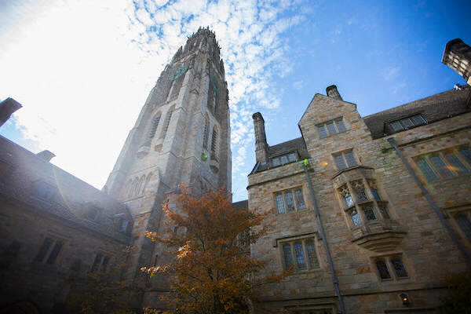
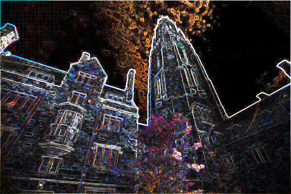

Uncompressed BMP filter
===

Basic image filter as proposed in the cs50, this implementation covers:

 * blur
 * grayscale
 * reflect
 * edges
 
Blur (-b option)
-
Adds blur filter to BMP file.

Grayscale
--
Turn a colored image to grayscale mode.

Reflect
--
Mirror (reflect) the image.

Edges
--
Detects the image edges using the Sobel Algorithm.

Compiling
--

Assuming that you have `clang` and `make` you type:

 > make filter

Usage
--

 > ./filter -[filter option] [input file] [output file]

e.g.

 > ./filter -b image.bmp blue.bmp
>
 > ./filter -g image.bmp grayscale.bmp
>
 > ./filter -r image.bmp reflected.bmp
>
 > ./filter -e image.bmp edges.bmp
